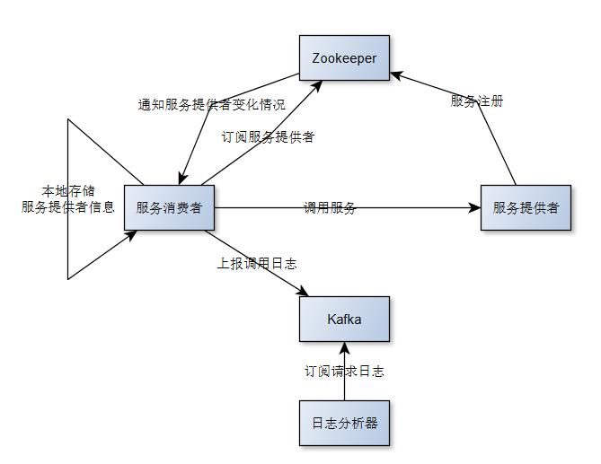
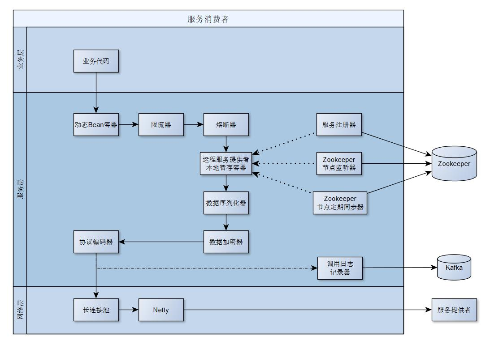
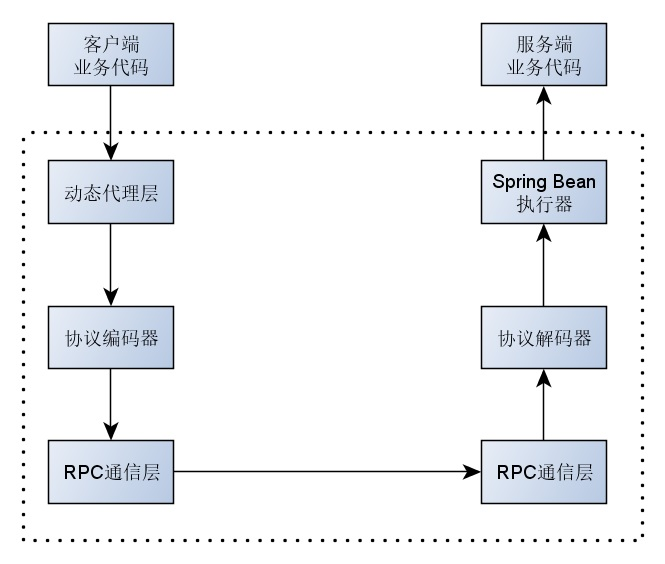

# AntRpc是什么？
AntRpc是一个Java的RPC框架，依赖于Spring。实现了RPC功能如下所示：
1. 开发环境时服务直接，简化开发调试过程；
2. 统一的调用链路标示，可以清晰的查看请求的整个调用链路，方便排查问题；
3. 通过Kafka上报调用日志，可选是否上报请求参数；
4. 熔断器，支持全局熔断器与指定接口熔断器；
5. 接口调用频率控制；
6. 接口异常错误时默认返回值；
7. 数据传输过程中的数据加解密；
8. 指定服务对外暴露的IP地址，简化多网卡时的配置；

# AntRpc总设计图

1. 服务提供者向注册中心Zookeeper注册自己提供的服务列表；
2. 服务消费者向注册中心Zookeeper订阅自己需要调用的服务；
3. Zookeeper节点发生变化时通知服务消费者；
4. 服务消费者在本地暂存服务提供者信息；
5. 服务消费者调用服务提供者；
6. 服务消费者现Kafka推送一个调用日志的消息；
7. 日志分析器从Kafka订阅日志；

## 服务消息者

## RPC调用流程器

# AntRpc核心接口
1. `io.github.wanggit.antrpc.IAntrpcContext`是整个RPC的上下文，其中包含各个组件的引用；
2. `io.github.wanggit.antrpc.commons.config.IConfiguration`包含RPC的所有配置；
3. `io.github.wanggit.antrpc.commons.codec.serialize.ISerializerHolder`管理RPC的序列化与序列化器；
4. `io.github.wanggit.antrpc.commons.codec.serialize.ISerializer`序列化与反序列化器，用户可自已实现此接口；
5. `io.github.wanggit.antrpc.commons.codec.cryption.ICodecHolder`加密与解密工具管理器；
6. `io.github.wanggit.antrpc.commons.codec.cryption.ICodec`加密与解密接口，用户可自己实现此接口；
7. `io.github.wanggit.antrpc.client.spring.IOnFailHolder`失败回调管理器；
8. `io.github.wanggit.antrpc.client.rate.IRateLimiting`接口调用频率管理器；
9. `io.github.wanggit.antrpc.commons.breaker.ICircuitBreaker`熔断器；
10. `io.github.wanggit.antrpc.client.spring.BeanContainer`RPC代理层的代理对象容器；
11. `io.github.wanggit.antrpc.client.zk.IZkClient`与Zookeeper保持连接的客户端；
12. `io.github.wanggit.antrpc.client.zk.register.IRegister`RPC服务通过此接口向Zookeeper进行注册；
13. `io.github.wanggit.antrpc.client.zk.listener.Listener`RPC服务监听Zookeeper中的其他RPC服务的状态；
14. `io.github.wanggit.antrpc.server.invoker.IRpcRequestBeanInvoker`RPC服务收到请求时执行业务代码的接口；

